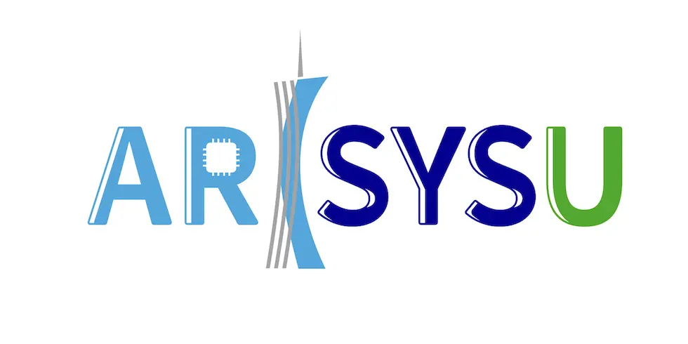

    
    

这是<a href="https://www.sysu.edu.cn/">中山大学</a> <i>arcSYSu</i> 实验室的官方网站。我们聚焦于计算机系统与体系结构领域的前沿研究，重点致力于推动高性能与智能计算技术的发展。更多详情请访问<a href="https://arcsysu.github.io/arcsysu/">官网</a>。

<b>我们始终欢迎充满热情的博士/硕士毕业生、博士后研究员以及本科研究助理或实习生加入我们的团队！参阅招生<a href="https://arcsysu.github.io/arcsysu/join"> FAQs </a>。</b>

